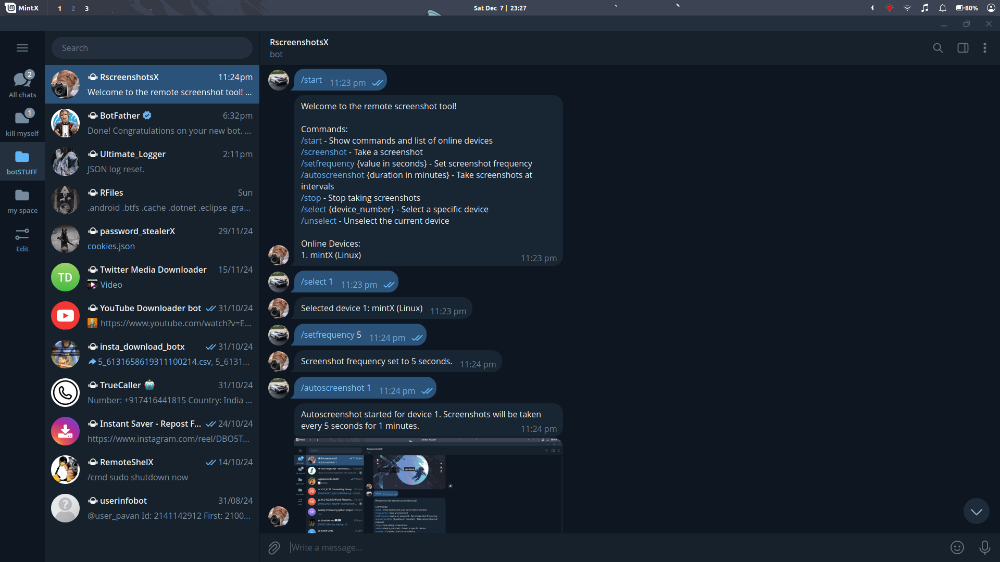

# Remote Screenshot Tool with Telegram Bot

This Python project allows you to control multiple PCs remotely using a Telegram bot. You can take screenshots, set screenshot intervals, and manage multiple devices easily. It works across **Windows**, **Linux**, and **macOS**.

## Features
- Take screenshots of a remote computer via Telegram.
- List online devices and select/unselect them for operations.
- Set screenshot frequency or enable auto-screenshots for a duration.
- Supports multiple operating systems (Windows, Linux, macOS).

## Installation Instructions

### Prerequisites
1. Python 3.7 or higher.
2. Telegram Bot API Token (Get it from [BotFather](https://core.telegram.org/bots#botfather)).

### Installing Dependencies
Run the following commands based on your operating system to install required Python packages:

```bash
pip install pyautogui python-telegram-bot
```

### Packaging the Application
You can use `pyinstaller` to create standalone executables for your platform.

#### Install PyInstaller
```bash
pip install pyinstaller
```

#### Create Executable
Run the following commands based on your operating system:

**For Linux:**
```bash
pyinstaller --onefile --noconsole bot.py
```

**For Windows:**
```cmd
pyinstaller --onefile --noconsole bot.py
```

**For macOS:**
```bash
pyinstaller --onefile --noconsole bot.py
```

This will generate a standalone executable in the `dist/` directory.

---

## Usage

1. Start the application on the devices you want to control.
2. Open Telegram and interact with your bot using the following commands:
   - `/start`: Show instructions and list online devices.
   - `/select {device_number}`: Select a specific device.
   - `/unselect`: Unselect the currently selected device.
   - `/screenshot`: Take a screenshot of the selected device.
   - `/setfrequency {value in seconds}`: Set the frequency for auto-screenshots.
   - `/autoscreenshot {duration in minutes}`: Enable auto-screenshot for a duration.
   - `/stop`: Stop auto-screenshotting.

---
## Screenshots

## Notes
- Screenshots are temporarily stored in the script's directory and are deleted after being sent to Telegram.
- Ensure the script is running on all devices you want to control.

Feel free to customize and extend this project as needed. Contributions are welcome!
